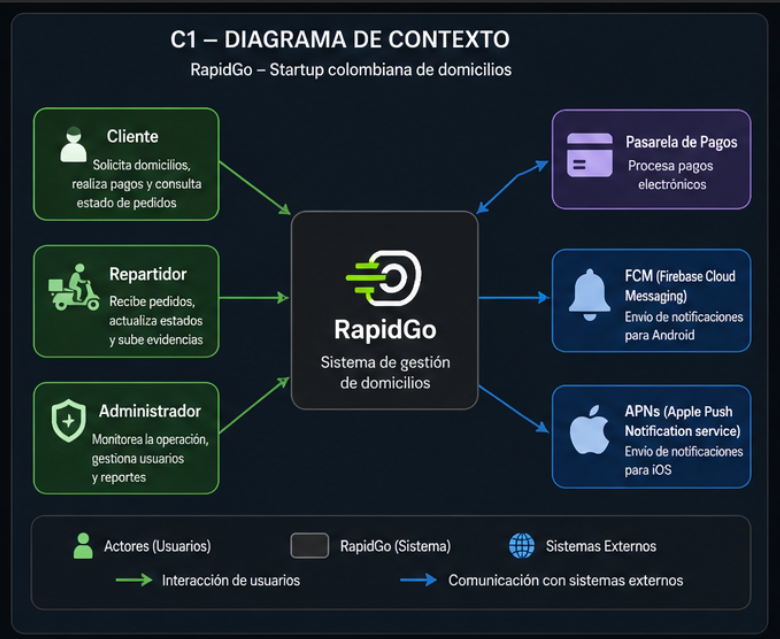
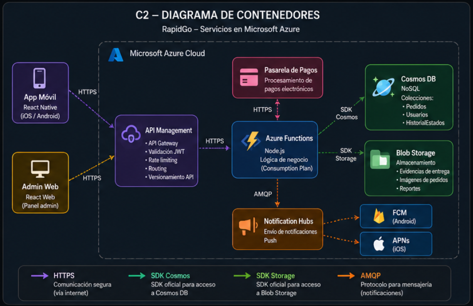
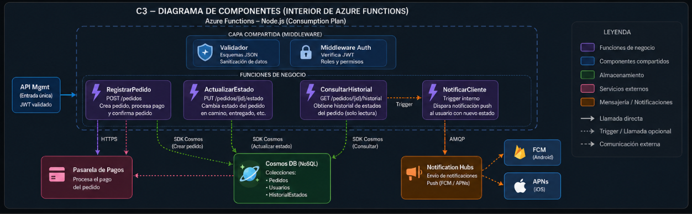
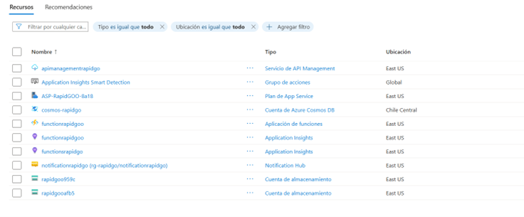
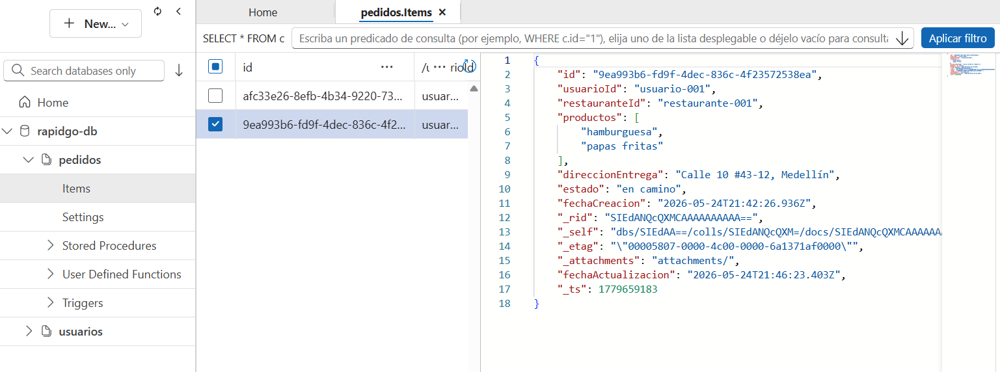

RapidGo — Backend Serverless en Azure

Tecnológico de Antioquia — Institución Universitaria**  
Computación en la Nube | Semestre 2026-1  
Profesor: Julian David Florez Sanchez  
Caso 01: Backend Serverless para Aplicación Móvil  

---

Integrantes

| Nombre completo | GitHub |
|---|---|
| Juan Felipe Reales De la Hoz | LilJdh1 |
| Dilan Esneider Echavarria Orozco | dilanmax08-ctrl |
| Brayan Castaño Borja | brayanborja27 |
| Brahian Alexis Bran Florez| brahianbran |

---

Descripción del proyecto

RapidGo es una startup colombiana de servicios de domicilios fundada 
en 2022 que opera en Medellín, Manizales y Pereira. Este repositorio 
documenta el diseño e implementación de su nuevo backend serverless 
en Microsoft Azure, migrando desde un monolito en Node.js hacia una 
arquitectura basada en cinco servicios cloud.

Problema que resuelve

| Problema actual | Solución implementada |
|---|---|
| Servidor dedicado $4.2M COP/mes | Azure Functions — pago por uso |
| Caídas en horas pico | Escalabilidad automática |
| Downtime en despliegues 20-30 min | Zero-downtime deployment |
| Push notifications 67% entrega | Notification Hubs — meta 95% |
| Sin tolerancia a fallos | Arquitectura serverless distribuida |

---

Stack tecnológico

| Servicio Azure | Responsabilidad |
|---|---|
| Azure Functions | Lógica de negocio — Node.js |
| API Management | Punto de entrada único — Auth JWT |
| Cosmos DB | Persistencia de pedidos y usuarios |
| Blob Storage | Fotos de comprobantes e imágenes |
| Notification Hubs | Push notifications Android e iOS |

---
 Tabla de contenido

- [Modelo C4](#modelo-c4)
  - [C1 — Contexto](#c1--contexto)
  - [C2 — Contenedores](#c2--contenedores)
  - [C3 — Componentes](#c3--componentes)
- [Decisiones Arquitectónicas (ADRs)](#decisiones-arquitectónicas-adrs)
  - [ADR-01 — Azure Functions vs App Service](#adr-01--azure-functions-vs-app-service)
  - [ADR-02 — Cosmos DB vs Azure SQL](#adr-02--cosmos-db-vs-azure-sql)
  - [ADR-03 — API Management vs exposición directa](#adr-03--api-management-vs-exposición-directa)
  - [ADR-04 — Blob Storage vs Azure Files](#adr-04--blob-storage-vs-azure-files)
  - [ADR-05 — Notification Hubs vs Azure Communication Services](#adr-05--notification-hubs-vs-azure-communication-services)
- [Implementación](#implementación)
- [Evidencias](#evidencias)
- [Conclusiones](#conclusiones)

---


## Modelo C4

### C1 — Contexto


| Componente |	Descripción |
|---|---|
|RapidGo	| Sistema central de gestión de domicilios. Es el núcleo que conecta todos los actores y sistemas externos.
|Cliente |	Actor que solicita domicilios, realiza pagos y consulta el estado de sus pedidos.
|Repartidor |	Actor que recibe los pedidos asignados, actualiza su estado y sube evidencias de entrega.
|Administrador |	Actor que monitorea la operación general, gestiona usuarios y genera reportes.
|Pasarela de Pagos	| Sistema externo que procesa los pagos electrónicos de los pedidos.
|FCM (Firebase Cloud Messaging)	| Sistema externo de Google para el envío de notificaciones push en dispositivos Android.
|APNs (Apple Push Notification Service) |	Sistema externo de Apple para el envío de notificaciones push en dispositivos iOS.


### C2 — Contenedores


|Componente	 | Descripción |
|---|---|
|App Móvil |	Aplicación desarrollada en React Native que corre en iOS y Android. Es la interfaz principal de clientes y repartidores.
|Admin Web	| Panel de administración desarrollado en React Web, usado por los administradores del sistema.
|API Management |	Puerta de entrada única a la plataforma. Gestiona el API Gateway, validación JWT, rate limiting, routing y versionamiento de la API.
|Azure Functions |	Núcleo de la lógica de negocio, desarrollado en Node.js bajo el plan de consumo. Orquesta todas las operaciones del sistema.
|Pasarela de Pagos | Contenedor externo que procesa los pagos electrónicos, se comunica con Azure Functions vía HTTPS.
|Cosmos DB |	Base de datos NoSQL que almacena las colecciones de Pedidos, Usuarios e HistorialEstados.
|Blob Storage |	Almacenamiento de archivos: evidencias de entrega, imágenes de pedidos y reportes.
|Notification Hubs |	Servicio de Azure que centraliza el envío de notificaciones push, distribuyéndolas a FCM y APNs.
|FCM	| Servicio de Firebase para notificaciones en Android.
|APNs |	Servicio de Apple para notificaciones en iOS.


### C3 — Componentes


|Componente	| Descripción |
|---|---|
|API Mgmt |	Entrada única al sistema, con JWT ya validado, que enruta las solicitudes hacia las funciones de negocio.
|Validador |	Middleware compartido que valida los esquemas JSON y sanitiza los datos de entrada.
|Middleware Auth |	Middleware compartido que verifica el token JWT y controla los roles y permisos del usuario.
|RegistrarPedido | Función de negocio expuesta en POST /pedidos. Crea el pedido, procesa el pago y confirma el pedido.
|ActualizarEstado |	Función de negocio expuesta en PUT /pedidos/{id}/estado. Cambia el estado del pedido (en camino, entregado, etc.).
|ConsultarHistorial |	Función de negocio expuesta en GET /pedidos/{id}/historial. Obtiene el historial de estados del pedido en modo solo lectura.
|NotificarCliente |	Función interna disparada por trigger. Envía una notificación push al usuario informando el nuevo estado del pedido.
|Pasarela de Pagos |	Servicio externo que procesa el pago del pedido, invocado por RegistrarPedido vía HTTPS.
|Cosmos DB (NoSQL) |	Base de datos que almacena las colecciones de Pedidos, Usuarios e HistorialEstados, accedida por las funciones vía SDK Cosmos.
|Notification Hubs |	Servicio que recibe la orden de notificación vía AMQP y la distribuye a FCM y APNs.
|FCM	| Destino final de notificaciones para dispositivos Android.
|APNs |	Destino final de notificaciones para dispositivos iOS.

---

## Decisiones Arquitectónicas (ADRs)

> ADRs en construcción — se agregarán en el siguiente commit.

---
## Implementación

### Flujo crítico implementado

El flujo crítico de RapidGo fue implementado y probado de extremo a extremo utilizando Azure Functions como backend serverless, Cosmos DB como base de datos, Notification Hubs para las notificaciones push y Postman como cliente HTTP para simular la aplicación móvil. Las peticiones fueron enrutadas a través de API Management como puerta de entrada única.

### Stack de pruebas

| Herramienta | Uso |
|---|---|
| Postman | Cliente HTTP para simular las peticiones de la app móvil |
| API Management | Puerta de entrada única que enruta las peticiones a las Functions |
| Azure Functions | Procesamiento de la lógica de negocio |
| Cosmos DB | Persistencia de los pedidos |
| Notification Hubs | Envío de notificaciones push |
| Firebase (FCM v1) | Proveedor de notificaciones Android |

### Paso 1 — Registrar pedido

**Endpoint:** `POST /rapidgo/pedidos`  
**Función:** `registrarPedido`  
**Descripción:** Recibe los datos del pedido, los valida y los persiste en Cosmos DB con estado `confirmado`.

**Body de la petición:**
```json
{
  "usuarioId": "usuario-002",
  "restauranteId": "restaurante-001",
  "productos": ["pizza", "gaseosa"],
  "direccionEntrega": "Carrera 80 #45-10, Medellín"
}
```

### Paso 2 — Actualizar estado

**Endpoint:** `PUT /rapidgo/pedidos/{id}`  
**Función:** `actualizarEstado`  
**Descripción:** Actualiza el estado del pedido a `en camino` en Cosmos DB y registra la fecha de actualización.

**Body de la petición:**
```json
{
  "estado": "en camino",
  "usuarioId": "usuario-002"
}
```

### Paso 3 — Enviar notificación push

**Endpoint:** `POST /rapidgo/notificaciones`  
**Función:** `notificarCliente`  
**Descripción:** Envía una notificación push al cliente informando el nuevo estado del pedido a través de Notification Hubs con FCM v1.

**Body de la petición:**
```json
{
  "usuarioId": "usuario-002",
  "pedidoId": "b4d76733-208d-47cd-956c-74e219dadae4",
  "estado": "en camino"
}
```

### Paso 4 — Consultar historial

**Endpoint:** `GET /rapidgo/pedidos/{id}?usuarioId={usuarioId}`  
**Función:** `consultarHistorial`  
**Descripción:** Consulta el estado actual y el historial del pedido desde Cosmos DB.


## Evidencias

### Servicios aprovisionados en Azure

Los cinco servicios requeridos fueron desplegados en el Resource Group `rg-rapidgo` en la región East US.



### Cosmos DB — Documento del pedido

El pedido fue persistido correctamente en la colección `pedidos` de la base de datos `rapidgo-db`.



### Postman — Ejecución del flujo crítico

#### Paso 1 — POST /pedidos


#### Paso 2 — PUT /pedidos/{id}


#### Paso 3 — POST /notificaciones


#### Paso 4 — GET /pedidos/{id}


## Conclusiones

La migración del backend monolítico de RapidGo hacia una arquitectura serverless en Microsoft Azure demostró ser una solución viable y efectiva para resolver los problemas críticos de escalabilidad, disponibilidad y costos que enfrentaba la empresa.

### Logros obtenidos

| Requerimiento | Métrica objetivo | Resultado |
|---|---|---|
| Disponibilidad | 99.9% mensual | Azure Functions con plan de consumo garantiza alta disponibilidad nativa sin administración de servidores. |
| Escalabilidad | 500 req/seg sin intervención | Escalabilidad elástica y automática de 0 a N instancias en respuesta inmediata a la demanda de pedidos. |
| Modelo de costos | Pago por uso real | Se eliminó el costo fijo de $4.2M COP mensuales del servidor dedicado, pagando solo por milisegundo de ejecución. |
| Despliegue | Zero-downtime | El esquema de despliegue de las Functions permite actualizar la lógica de negocio sin interrumpir los flujos en curso. |
| Notificaciones push | Tasa de entrega > 95% | Azure Notification Hubs integrado con FCM v1 garantiza un canal de alertas eficiente y directo hacia los clientes. |
| Tolerancia a fallos | Sin punto único de fallo | Diseño basado en una arquitectura distribuida y desacoplada utilizando los servicios administrados de Azure. |

### Aprendizajes del equipo

- La arquitectura serverless exige un cambio de paradigma frente al desarrollo tradicional, requiriendo que cada componente sea completamente desacoplado, orientado a eventos y stateless (sin estado).
- Azure Functions bajo el plan de consumo demostró ser la alternativa más costo-eficiente para manejar la predictibilidad y los picos de demanda característicos del sector de domicilios en el Valle de Aburrá.
- Cosmos DB como base de datos NoSQL validó la decisión de migrar desde un modelo relacional rígido como MySQL, ofreciendo la flexibilidad necesaria para iterar sobre los esquemas de pedidos y comercios sin fricción.
- La combinación de Notification Hubs y FCM v1 dotó al sistema de una infraestructura robusta de mensajería, logrando revertir y superar con creces la deficiente tasa de entrega del 67% que registraba la plataforma anterior.
- API Management consolidó la seguridad y el orden del ecosistema al actuar como una fachada única de entrada, simplificando tareas complejas de control de acceso, enrutamiento y futuro versionado de los contratos de la API.
- El aprovechamiento del crédito de Azure for Students demostró que es viable diseñar, desplegar y validar arquitecturas de software de nivel empresarial manteniéndose estrictamente dentro de los límites del presupuesto asignado para soluciones piloto.


## ADR-01: Azure Functions vs App Service para la lógica de negocio

### Título
Uso de Azure Functions con Consumption Plan sobre Azure App Service para la lógica de negocio de RapidGo.

### Contexto
RapidGo opera con un patrón de tráfico altamente variable: en horas de baja demanda (2am–8am) el uso de CPU no supera el 4%, mientras que en horas pico (12m–2pm y 6pm–9pm) y días festivos se alcanzan hasta 4.500 pedidos diarios. El servidor dedicado actual cuesta $4.200.000 COP mensuales con costo fijo independiente del tráfico real, y cualquier actualización requiere entre 20 y 30 minutos de inactividad. El equipo de infraestructura es de una sola persona, por lo que se debe minimizar la carga operativa. El presupuesto en Azure no debe superar los $50 USD mensuales durante la fase piloto.

### Alternativas evaluadas

**Azure App Service (Plan B1)**
Servicio de hospedaje que mantiene una instancia activa de forma permanente. No tiene cold start, pero su costo mínimo es ~$13 USD/mes incluso en horas de madrugada con tráfico casi nulo. Escalar ante picos requiere configurar reglas de autoescalado manualmente. Los despliegues sin downtime requieren deployment slots, no disponibles en tiers económicos.

**Azure Functions (Consumption Plan)**
Modelo serverless donde cada función se factura únicamente por ejecuciones realizadas, con el primer millón gratuitas por mes. La escalabilidad es completamente automática hasta los 500 req/seg requeridos. El equipo tiene experiencia en Node.js y Python, ambos soportados oficialmente. La única desventaja es el cold start: primera ejecución puede tardar entre 300 y 800ms adicionales.

### Decisión
Se elige **Azure Functions con Consumption Plan**. El modelo de pago por uso elimina el costo fijo ineficiente del servidor actual. La escalabilidad automática cubre el requerimiento de 500 req/seg sin intervención del equipo. Los despliegues zero-downtime son nativos. El cold start es aceptable dado que API Management puede configurarse con warm-up policies para rutas críticas.

### Consecuencias

**Lo que ganamos**
- Costo mensual alineado con el tráfico real, dentro del límite de $50 USD del piloto.
- Escalabilidad automática en picos sin intervención del equipo.
- Despliegues zero-downtime como comportamiento por defecto.

**Lo que perdemos o asumimos como trade-off**
- Cold starts de 300–800ms en funciones poco frecuentes, potencialmente cercanos al límite del SLA de 800ms.
- Límite de 10 minutos por ejecución en el Consumption Plan; tareas pesadas futuras deberán rediseñarse.

---

## ADR-02: Cosmos DB vs Azure SQL Database para la persistencia de pedidos

### Título
Uso de Azure Cosmos DB (API NoSQL) sobre Azure SQL Database para la persistencia de pedidos y usuarios de RapidGo.

### Contexto
La base de datos actual es MySQL relacional con 3 años de datos históricos. Se requiere evaluar si mantener el paradigma relacional o migrar a NoSQL. El sistema debe soportar 500 req/seg sin intervención manual y latencia de API menor a 800ms en P95. Los pedidos tienen atributos variables según el tipo de negocio (restaurantes vs. tiendas), lo que genera múltiples columnas nullable y tablas de extensión difíciles de mantener. Por restricción de soberanía de datos, toda la información de usuarios colombianos debe almacenarse en Brazil South o East US. El free tier de Cosmos DB ofrece 1.000 RU/s y 25 GB incluidos.

### Alternativas evaluadas

**Azure SQL Database (free tier)**
Compatible con el esquema MySQL actual, simplifica la migración de datos históricos. Sin embargo, bajo cargas sostenidas de 500 req/seg el tiempo de respuesta puede degradarse por encima del SLA de 800ms. Escalar implica un costo fijo que compromete el presupuesto. La estructura rígida dificulta incorporar atributos variables por tipo de negocio.

**Azure Cosmos DB (API NoSQL)**
Base de datos distribuida con modelo de documento JSON, escalabilidad horizontal automática y latencia garantizada menor a 10ms en P99. El modelo de documentos se adapta naturalmente a pedidos con estructuras variables. Disponible en East US, cumpliendo la restricción de soberanía. La desventaja principal es migrar el esquema MySQL a documentos JSON y la curva de aprendizaje del modelo de particionamiento.

### Decisión
Se elige **Azure Cosmos DB con API NoSQL**, desplegado en **East US** (menor latencia hacia Medellín, Manizales y Pereira que Brazil South, con disponibilidad confirmada del free tier). La estructura de documentos JSON resuelve el problema de atributos variables, la escalabilidad automática satisface los 500 req/seg sin carga operativa, y la latencia garantizada cumple holgadamente el SLA. La migración de datos históricos se realizará mediante un script documentado en `/src/migration/`.

### Consecuencias

**Lo que ganamos**
- Datos de usuarios colombianos en East US, cumpliendo la restricción de soberanía.
- Escalabilidad horizontal automática en picos sin intervención manual.
- Latencia muy por debajo del SLA de 800ms.
- Esquema flexible para nuevos tipos de negocios sin migraciones de base de datos.

**Lo que perdemos o asumimos como trade-off**
- Abandono del paradigma relacional; requiere aprendizaje de particionamiento y consistencia eventual.
- Migración del esquema MySQL a documentos JSON recae sobre el único miembro del equipo.
- Consultas analíticas complejas con JOINs son más costosas en RU/s; se mitigarán exportando datos periódicamente a Blob Storage.
- El free tier de Cosmos DB es único por suscripción; si ya está en uso, se deberá evaluar Azure SQL Database como alternativa.


  

## ADR-03: API Management vs exposición directa de las Functions

### Título
Uso de Azure API Management como punto de entrada único sobre la exposición directa de Azure Functions.

### Contexto
La deuda técnica actual incluye manejo artesanal de tokens JWT implementado directamente en el monolito, sin un gateway centralizado para autenticación, throttling ni versionado. La app móvil en React Native no se rediseñará, por lo que la nueva API debe mantener compatibilidad con los contratos de endpoints actuales (mismas rutas y estructura de respuesta JSON). En el futuro se planea incorporar nuevos clientes como app web y API pública para terceros. El requerimiento de disponibilidad es 99.9% mensual. El presupuesto mensual no debe superar los $50 USD durante la fase piloto.

### Alternativas evaluadas

**Exposición directa de Azure Functions (HTTP trigger)**
No agrega costo ni latencia adicional. Sin embargo, cada función debe implementar por separado su propia lógica de validación JWT, throttling y control de versiones, multiplicando la carga de mantenimiento sobre el único miembro del equipo. Si en el futuro se agregan nuevos clientes, cada uno deberá conectarse directamente a las funciones individuales, haciendo el sistema difícil de evolucionar sin romper los contratos de la app React Native.

**Azure API Management (Developer tier)**
Gateway administrado que actúa como punto de entrada único. Centraliza la validación JWT mediante políticas declarativas y permite configurar throttling por usuario/IP sin escribir código adicional. Soporta versionado de API nativo para introducir cambios sin afectar la app móvil actual. Su desventaja principal es el costo: el Developer tier tiene un precio de ~$49 USD/mes, consumiendo casi la totalidad del presupuesto piloto.

### Decisión
Se elige **Azure API Management en Developer tier**, reconociendo explícitamente que su costo de ~$49 USD/mes consume la mayor parte del presupuesto piloto. Se justifica porque centraliza la autenticación JWT (resuelve la deuda técnica crítica), el throttling declarativo protege las Functions sin esfuerzo adicional del equipo, y el URL mapping garantiza compatibilidad con los contratos de la app React Native sin tocar el código móvil. La viabilidad económica depende del uso de créditos Azure for Students ($100 USD). Sin créditos estudiantiles, se deberá implementar validación JWT como middleware compartido y exponer las Functions directamente.

### Consecuencias

**Lo que ganamos**
- Autenticación JWT centralizada en un único punto, eliminando la deuda técnica del monolito.
- Throttling declarativo que protege automáticamente las Functions en días festivos.
- Versionado nativo para evolucionar la API sin romper la app móvil.
- Observabilidad consolidada en el portal de Azure con métricas por endpoint.

**Lo que perdemos o asumimos como trade-off**
- Costo de ~$49 USD/mes ocupa casi la totalidad del presupuesto piloto; solución inviable sin créditos estudiantiles.
- Developer tier sin SLA de disponibilidad para producción; migrar a Standard tier cuesta ~$300 USD/mes.
- Latencia adicional de ~20–50ms por el paso del gateway (aún compatible con SLA de 800ms en P95).

---

## ADR-04: Blob Storage vs Azure Files para almacenamiento de archivos

### Título
Uso de Azure Blob Storage (LRS Standard) sobre Azure Files para el almacenamiento de comprobantes de entrega e imágenes de productos de RapidGo.

### Contexto
RapidGo necesita almacenar tres tipos de archivos: fotos de comprobantes de entrega tomadas por repartidores desde la app móvil, imágenes de productos de restaurantes y tiendas, y exports de reportes operacionales generados periódicamente. Estos archivos deben ser accesibles directamente desde la app React Native mediante URLs, sin requerir montaje de sistemas de archivos. El equipo de infraestructura es de una sola persona y debe minimizarse la carga operativa. El presupuesto del piloto es de $50 USD mensuales.

### Alternativas evaluadas

**Azure Files**
Servicio de almacenamiento que expone archivos mediante protocolos SMB y NFS, pensado para montarse como unidad de red. No es compatible con la app móvil React Native, que necesita descargar imágenes mediante URLs HTTP directas sin montar ningún volumen. Su costo por GB (~$0.06 USD/GB/mes Standard) es aproximadamente tres veces mayor que Blob Storage, y su administración requiere configurar shares, permisos de red y puntos de montaje.

**Azure Blob Storage (LRS Standard)**
Servicio de almacenamiento de objetos diseñado para archivos no estructurados accesibles mediante URLs HTTP. Soporta SAS tokens (Shared Access Signatures) para dar acceso temporal y controlado sin exponer archivos públicamente de forma permanente, ideal para que repartidores suban comprobantes y clientes los visualicen desde la app. Su costo por GB es de ~$0.018 USD/mes en LRS. La integración con Azure Functions mediante Blob triggers es nativa en el SDK.

### Decisión
Se elige **Azure Blob Storage con redundancia LRS Standard**. El modelo de acceso por URL HTTP con SAS tokens es el patrón correcto para todos los casos de uso de RapidGo: repartidores suben fotos desde la app móvil, clientes las visualizan en la misma app, y los reportes se descargan desde el portal administrativo, todo mediante URLs directas. Azure Files no agrega valor en este contexto y triplica el costo de almacenamiento.

### Consecuencias

**Lo que ganamos**
- Acceso desde la app móvil mediante URLs directas con SAS tokens de tiempo limitado, sin complejidad adicional en el cliente.
- Costo por GB significativamente menor que Azure Files, contribuyendo a mantenerse dentro del presupuesto piloto.
- Integración nativa con Azure Functions mediante Blob triggers para automatizar el procesamiento de imágenes.
- Sin administración de shares, permisos de red ni puntos de montaje.

**Lo que perdemos o asumimos como trade-off**
- Redundancia LRS replica datos únicamente dentro de una sola región; un fallo a nivel de datacenter podría implicar pérdida de datos. En producción real se debería evaluar migrar a GRS (redundancia geográfica).
- Blob Storage no soporta acceso por protocolo SMB/NFS; si algún servicio interno futuro requiriera montar archivos como unidad de red, sería necesario agregar Azure Files al stack.


## ADR-05: Notification Hubs vs Azure Communication Services

### Título
Uso de Azure Notification Hubs sobre Azure Communication Services para notificaciones push a clientes de RapidGo.

### Contexto
El sistema actual de notificaciones push de RapidGo tiene una tasa de entrega del 67% debido a la falta de integración directa con FCM (Firebase Cloud Messaging, para Android) y APNs (Apple Push Notification service, para iOS). Esto genera confusión en los clientes sobre el estado de sus pedidos y contribuye a cancelaciones evitables. El requerimiento es alcanzar una tasa de entrega superior al 95%. RapidGo tiene usuarios en Android e iOS y 340 repartidores activos que también reciben notificaciones de nuevos pedidos asignados. El free tier de Notification Hubs incluye 1 millón de notificaciones al mes. El equipo no tiene experiencia previa con servicios de comunicaciones en la nube.

### Alternativas evaluadas

**Azure Communication Services (ACS)**
Plataforma multicanal que centraliza email, SMS, voz, chat y notificaciones push en un único servicio. Su fortaleza está en los canales de email y SMS (1 millón de emails mensuales gratis). Para push notifications móviles, ACS requiere configuración adicional y su soporte para FCM y APNs, aunque existente, no es su caso de uso principal. No tiene free tier específico para push, lo que implica costos adicionales fuera del presupuesto piloto. Representa mayor curva de aprendizaje para un equipo sin experiencia previa en comunicaciones cloud.

**Azure Notification Hubs**
Servicio diseñado específicamente para el envío masivo de notificaciones push a dispositivos Android e iOS. Se integra directamente con FCM v1 y APNs mediante certificados y credenciales configuradas en el portal de Azure, eliminando la capa artesanal que hoy causa la baja tasa de entrega del 67%. El free tier incluye 1 millón de notificaciones al mes, suficiente para el volumen estimado del piloto (~50.000–100.000 notificaciones mensuales). El SDK está disponible para Node.js, compatible con el runtime de las Azure Functions del equipo. La configuración puede probarse desde el portal de Azure sin necesidad de un dispositivo físico.

### Decisión
Se elige **Azure Notification Hubs**. La causa raíz de la baja tasa de entrega actual es la ausencia de integración directa con FCM y APNs, y Notification Hubs resuelve exactamente ese problema con integración nativa y documentada para ambas plataformas. El free tier cubre el volumen del piloto sin costo adicional. El SDK para Node.js facilita la integración con las Azure Functions sin requerir que el equipo aprenda nuevos lenguajes o plataformas.

### Consecuencias

**Lo que ganamos**
- Integración directa con FCM v1 y APNs eleva la tasa de entrega del 67% actual a más del 95% requerido, mejorando directamente la experiencia del cliente con estados de pedido en tiempo real.
- El free tier cubre el volumen estimado del piloto sin impactar el presupuesto.
- Configuración y pruebas de envío desde el portal de Azure sin dispositivo físico, reduciendo la fricción para el equipo de una sola persona.

**Lo que perdemos o asumimos como trade-off**
- Notification Hubs se encuentra en **modo de mantenimiento** en el roadmap de Azure; Microsoft no está invirtiendo activamente en nuevas funcionalidades. A largo plazo, la recomendación oficial es migrar a integración directa con Firebase. El equipo debe tenerlo en cuenta para la planificación a 12–18 meses.
- Si en el futuro RapidGo necesita notificaciones por email o SMS (para usuarios sin la app instalada), será necesario agregar Azure Communication Services al stack, ya que Notification Hubs solo cubre el canal push.


